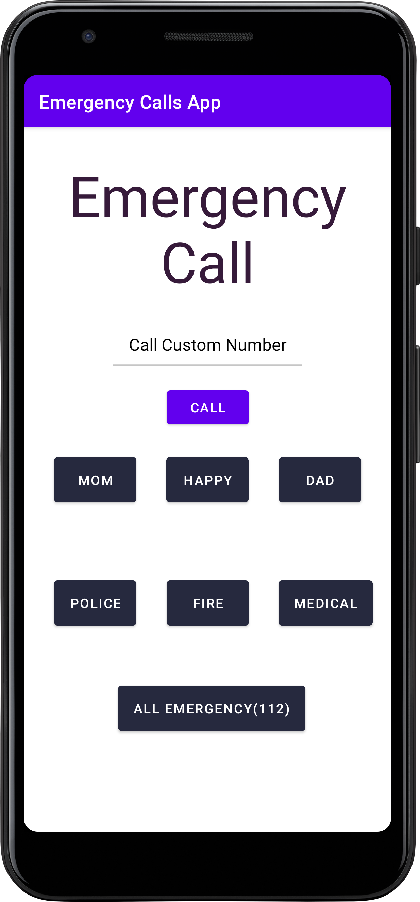

# Emergency Calls App

This Android app allows users to make emergency calls with predefined contacts or custom numbers.
The app provides quick access to emergency services and important contacts.

## Features

- **Predefined Contacts:** Quickly call predefined contacts such as family members or emergency services with the touch of a button.
- **Custom Emergency Call:** Enter a custom phone number and make an emergency call.
- **Title Updates:** The app dynamically updates the title to inform users about the ongoing call.

## Usage

1. **Predefined Contacts:**
    - Press the "Happy" button to call a predefined contact labeled as "Happy."
    - Press the "Mom" button to call a predefined contact labeled as "Mom."
    - Press the "Dad" button to call a predefined contact labeled as "Dad."
    - Press the "Police" button to call the emergency police number (100).
    - Press the "Fire" button to call the emergency fire number (101).
    - Press the "Medical" button to call the emergency medical number (108).
    - Press the "All Emergency" button to call the general emergency number (112).

2. **Custom Emergency Call:**
    - Enter a custom phone number in the provided EditText field.
    - Press the "Call" button to make an emergency call to the entered number.

3. **Title Updates:**
    - The title dynamically updates to reflect the ongoing call, 
   providing information about the contact or service being called.

## Getting Started

To use this project, follow these steps:

1. Clone the repository:

   ```bash
   git clone https://github.com/Hardvan/Emergency-Caller-App.git
   ```

2. Open the project in Android Studio.

3. Run the app on an Android emulator or physical device.

## Screenshots


